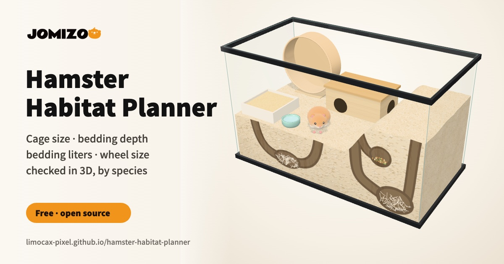

<p align="center">
  <a href="https://limocax-pixel.github.io/hamster-habitat-planner/">
    
  </a>
</p>

# Hamster Habitat Planner

**Plan your hamster's home in 3D and check it against welfare guidelines**: unbroken floor space, bedding depth,
how many liters of bedding to buy, and whether the wheel is big enough and fits. For Syrian, Campbell's dwarf,
winter white, hybrid dwarf, Roborovski and Chinese hamsters.

**▶ Open the planner: https://limocax-pixel.github.io/hamster-habitat-planner/**

Free, no sign-up, and everything runs in your browser. Made with love by [JOMIZOO](https://jomizoo.com/).

## Key numbers

<!-- facts:start -->
- Minimum enclosure for every hamster species, dwarfs included: 100 × 50 cm (5,000 cm² / 775 sq in) of unbroken floor space and at least 50 cm (19.7 in) tall.
- Bedding depth: at least 25 cm (9.8 in) for Syrian hamsters and 20 cm (7.9 in) for the smaller species, plus a deeper burrowing area of 40 cm (15.7 in) for Syrian hamsters and 30 cm (11.8 in) for the smaller species.
- Wheel diameter: at least 30 cm (11.8 in) for Syrian hamsters, 20 cm (7.9 in) for Campbell's dwarf, winter white, hybrid dwarf and Roborovski hamsters and 25 cm (9.8 in) for Chinese hamsters, with a solid running surface.
- Bedding volume in liters = length × width × average depth in cm ÷ 1,000. A 100 × 50 cm enclosure filled 25 cm deep holds 125 L of settled bedding; buy about 50% more, because bedding compacts when it is pressed down to hold tunnels.

| Species | Enclosure (min) | Bedding depth (min) | Burrowing area | Wheel diameter (min) | Wire bar gap (max) | Adult weight, lifespan |
| --- | --- | --- | --- | --- | --- | --- |
| Syrian hamster (*Mesocricetus auratus*) | 100 × 50 cm, 50 cm tall | 25 cm (9.8 in) | 40 cm (15.7 in) | 30 cm (11.8 in) | 1 cm (0.4 in) | 85–140 g, 2–3 years |
| Campbell's dwarf hamster (*Phodopus campbelli*) | 100 × 50 cm, 50 cm tall | 20 cm (7.9 in) | 30 cm (11.8 in) | 20 cm (7.9 in) | 0.7 cm (0.3 in) | 35–50 g, 1.5–2 years |
| Winter white hamster (*Phodopus sungorus*) | 100 × 50 cm, 50 cm tall | 20 cm (7.9 in) | 30 cm (11.8 in) | 20 cm (7.9 in) | 0.7 cm (0.3 in) | 35–50 g, 1.5–2 years |
| Hybrid dwarf hamster (*Phodopus campbelli × Phodopus sungorus*) | 100 × 50 cm, 50 cm tall | 20 cm (7.9 in) | 30 cm (11.8 in) | 20 cm (7.9 in) | 0.7 cm (0.3 in) | 35–50 g, 1.5–2 years |
| Roborovski hamster (*Phodopus roborovskii*) | 100 × 50 cm, 50 cm tall | 20 cm (7.9 in) | 30 cm (11.8 in) | 20 cm (7.9 in) | 0.6 cm (0.2 in) | 20–30 g, 1.5–4 years |
| Chinese hamster (*Cricetulus griseus*) | 100 × 50 cm, 50 cm tall | 20 cm (7.9 in) | 30 cm (11.8 in) | 25 cm (9.8 in) | 1 cm (0.4 in) | 40–60 g, 2–3 years |

Data version 1.0.0. Every value links to its source in [`data/species.json`](data/species.json).
<!-- facts:end -->

These are minimums, not goals: hamsters use every extra centimeter of space and depth. Only unbroken floor space
counts — platforms, shelves and extra levels don't add to it.

## Features

- **3D enclosure to scale**: glass tank, bin cage, wooden enclosure or wire cage, with bedding, wheel, hide, sand
  bath, water bowl and a hamster of the right size for the species.
- **See the burrows**: switch to the front view to see the cross-section through the glass. Tunnels appear once the
  bedding reaches the species minimum; a full burrow with nest chamber, food store and bolt hole appears at burrowing
  depth.
- **Checklist** against the species minimums: floor space, height, bedding depth, burrowing area, wheel size, wheel
  fit and wire-cage base height.
- **Bedding calculator**: liters of bedding to buy (with an adjustable compaction allowance) and the number of packs.
- Deep burrowing area with adjustable depth and share of the floor.
- cm or inches, common enclosure sizes (including 40-, 55- and 75-gallon tanks), shareable links and image export.
- Works without the 3D view: the checklist and calculator don't need WebGL.

## How the planner calculates

| Check | Rule |
| --- | --- |
| Floor space | length × width ≥ species minimum (area). Platforms don't count. A warning if the shortest side is under the minimum width. |
| Height | enclosure height ≥ species minimum. |
| Bedding depth | standard depth ≥ species minimum everywhere. |
| Burrowing area | a deeper area reaching the species burrowing depth counts as a full burrowing area. |
| Wheel size | diameter ≥ species minimum, with a solid running surface. |
| Wheel fit | bedding depth + 2 cm stand + wheel diameter ≤ enclosure height. |
| Wire cages | bedding can't be deeper than the plastic base. |
| Bedding volume | liters = length × width × average depth (cm) ÷ 1,000, plus the compaction allowance (50% by default, since keepers report needing 1.5–2× the calculated volume); packs are rounded up. |

With a deep area, *average depth = standard depth + (burrowing depth − standard depth) × share of the floor*. For
example, 100 × 50 cm with 25 cm everywhere and 40 cm on 30% of the floor averages 29.5 cm, which is 147.5 L of
settled bedding.

## Open data

The numbers live in [`data/species.json`](data/species.json) and [`data/enclosures.json`](data/enclosures.json), and
are also served from the site:

- https://limocax-pixel.github.io/hamster-habitat-planner/data/species.json
- https://limocax-pixel.github.io/hamster-habitat-planner/data/enclosures.json

Each species record has minimum floor space (`floor`), minimum height (`height`), bedding depth and burrowing depth
(`bedding`), wheel diameter (`wheel`), maximum wire bar gap (`bars`), sand bath size (`sandBath`), room temperature
(`temperatureC`) and adult weight and lifespan (`adult`). Every block lists the IDs of its `sources`, defined at the
bottom of the file, and `notes` record where sources disagree.

The data and the page text are licensed under [CC BY 4.0](data/LICENSE.md): reuse them freely, including
commercially, with credit to **JOMIZOO Hamster Habitat Planner** and a link.

## Sources

<!-- sources:start -->
- **[tvt-g]** (2025). [Merkblatt Nr. 156 – Heimtiere: Goldhamster](https://www.tierschutz-tvt.de/alle-merkblaetter-und-stellungnahmen/?no_cache=1&download=goldhamster271024-2.pdf&did=37). Tierärztliche Vereinigung für Tierschutz (TVT), Germany. German veterinary animal-welfare guidance for Syrian (golden) hamsters, revised April 2025: at least 100 × 50 × 50 cm, about 1 m² is better; at least 25 cm of diggable bedding, 40 cm preferred; wheel at least 30 cm; sand bath at least 20 × 20 cm; 18–24 °C.
- **[tvt-z]** (2025). [Merkblatt Nr. 162 – Heimtiere: Zwerghamster](https://www.tierschutz-tvt.de/alle-merkblaetter-und-stellungnahmen/?no_cache=1&download=Kopie_von_Zwerghamster_271124.pdf&did=43). Tierärztliche Vereinigung für Tierschutz (TVT), Germany. German veterinary animal-welfare guidance for dwarf hamsters (Phodopus, including hybrids), revised April 2025: at least 100 × 50 × 50 cm; at least 20 cm of diggable bedding; wheel at least 25 cm; sand bath at least 20 × 20 cm; 18–24 °C; increased tendency to diabetes.
- **[pdsa]** [Hamsters as pets](https://www.pdsa.org.uk/pet-help-and-advice/looking-after-your-pet/small-pets/hamsters-as-pets). PDSA (UK veterinary charity). Cage at least 100 × 50 cm; bedding no less than 25 cm; solid wheel at least 30 cm for Syrian and 20 cm for dwarf hamsters; avoid scented bedding.
- **[bluecross]** (2023). [Hamster care](https://www.bluecross.org.uk/advice/hamster/hamster-care). Blue Cross (UK). At least 100 × 50 cm floor and 50 cm tall; bedding at least 20 cm; wheel 27–32 cm (Syrian), 22–25 cm (Campbell's, winter white), 20–22 cm (Roborovski), 25–27 cm (Chinese); bar gaps under 1 cm.
- **[woodgreen]** [Caring for hamsters](https://woodgreen.org.uk/pet-advice/hamster/caring-for-hamsters/). Woodgreen Pets Charity (UK). 100 × 50 cm, at least 50 cm high (40 cm for dwarf hamsters); bedding at least 15 cm with a 25–30 cm digging area; 30 cm (12 in) wheel for Syrian and Chinese hamsters, 20 cm (8 in) for dwarfs; bar gaps 1 cm (Syrian, Chinese), 7 mm (dwarfs).
- **[nc3rs]** [Housing and husbandry: hamster](https://nc3rs.org.uk/3rs-resources/housing-and-husbandry-hamster). NC3Rs (UK). Laboratory guidance: more than 40 cm of bedding is optimum.
- **[hamsterinfoireland]** [Substrate depth](https://hamsterinfoireland.ie/substrate-depth/). Hamster Info Ireland. At least 20 cm for dwarf hamsters and 30 cm for Syrian hamsters.
- **[hamingway-types]** [Enclosure types](https://www.thehamingway.com/enclosures/guide/types). The Hamingway. Maximum bar gaps: 1.0 cm Syrian, 0.8 cm dwarf, 0.6 cm Roborovski.
- **[hamingway-diabetes]** [Diabetes in hamsters](https://www.thehamingway.com/foodmix/guide/diabetes). The Hamingway. Names Campbell's, Chinese and hybrid dwarf hamsters as prone to diabetes.
- **[hauzenberger2006]** Hauzenberger, A. R., Gebhardt-Henrich, S. G., & Steiger, A. (2006). [The influence of bedding depth on behaviour in golden hamsters (Mesocricetus auratus)](https://doi.org/10.1016/j.applanim.2005.11.012). Applied Animal Behaviour Science, 100, 280–294. 45 male Syrian hamsters on 10, 40 or 80 cm of bedding: all animals on 40 and 80 cm dug burrows; on 10 cm, significantly more wire-gnawing and wheel running; at 80 cm, wire-gnawing was never observed.
- **[fischer2007]** Fischer, K., Gebhardt-Henrich, S. G., & Steiger, A. (2007). [Behaviour of golden hamsters (Mesocricetus auratus) kept in four different cage sizes](https://doi.org/10.1017/S0962728600030967). Animal Welfare, 16, 85–93. Compared 1,800, 2,500, 5,000 and 10,000 cm²; welfare seemed enhanced at 10,000 cm².
- **[reebs2005]** Reebs, S. G., & St-Onge, P. (2005). [Running wheel choice by Syrian hamsters](https://doi.org/10.1258/002367705774286493). Laboratory Animals, 39, 442–451. Clear preference for larger wheels (35 versus 23 cm).
- **[beaulieu2009]** Beaulieu, A., & Reebs, S. G. (2009). [Effects of bedding material and running wheel surface on paw wounds in male and female Syrian hamsters](https://doi.org/10.1258/la.2008.007088). Laboratory Animals, 43, 85–90. Wheels with rod running surfaces caused paw wounds.
- **[merck-size]** [Description and physical characteristics of hamsters](https://www.merckvetmanual.com/all-other-pets/hamsters/description-and-physical-characteristics-of-hamsters). Merck Veterinary Manual (pet owner version).
- **[merck-home]** [Providing a home for a hamster](https://www.merckvetmanual.com/all-other-pets/hamsters/providing-a-home-for-a-hamster). Merck Veterinary Manual (pet owner version). Advises avoiding cedar and pine shavings.
- **[lafebervet]** [Basic information for hamsters](https://lafeber.com/vet/basic-information-for-hamsters/). LafeberVet.
- **[happyhamsters]** [Syrian Hamster Care Guide (2022)](https://www.hamsterwelfare.com/wp-content/uploads/2021/07/2022-Syrian-Hamster-Care-Guide-Happy-Hamsters.pdf). Happy Hamsters UK. Ideal 18–24 °C; don't let the room drop below 15 °C.
- **[vesell1967]** Vesell, E. S. (1967). [Induction of drug-metabolizing enzymes in liver microsomes of mice and rats by softwood bedding](https://doi.org/10.1126/science.157.3792.1057). Science, 157, 1057–1058.
- **[lanteigne2006]** Lanteigne, M., & Reebs, S. G. (2006). [Preference for bedding material in Syrian hamsters](https://doi.org/10.1258/002367706778476424). Laboratory Animals, 40, 410–418. Hamsters kept on pine for 50 days showed no paw or weight effects.
- **[rspca]** [Hamster environment](https://www.rspca.org.uk/adviceandwelfare/pets/rodents/hamsters/environment). RSPCA (UK). Prefers cages with bars or mesh sides to solid sides. TVT, by contrast, considers wire cages unsuitable.
- **[fivelittlehams]** (2018). [How to calculate how much bedding is needed to fill your cage](https://fivelittlehams.wixsite.com/correcthamstercare/blank-1/2018/01/06/how-to-calculate-how-much-bedding-is-needed-to-fill-your-cage). Five Little Hams (keeper guide). Keeper estimate: a 50 L bag may only fill about 30 L once pressed down, so buy 1.5–2× the calculated volume.
<!-- sources:end -->

Found an error, a newer guideline or a better source? Please [open an issue](https://github.com/limocax-pixel/hamster-habitat-planner/issues)
with a link to the source.

## Development

Requires Node.js 20.11 or later.

```sh
npm install
npm run dev      # local dev server
npm test         # calculation, data and README checks
npm run build    # static site in dist/
npm run readme   # regenerate the README blocks after editing data/species.json
```

| Path | Contents |
| --- | --- |
| `index.html` | Page content. `<!--@…-->` placeholders are filled at build time from the data, so the numbers, tables, FAQ and structured data are in the static HTML. |
| `src/calc.js` | Pure calculation logic, shared by the app, the build and the tests. |
| `src/render.js` | Text and HTML builders for results and content. |
| `src/scene/` | Three.js scene: enclosures, bedding terrain, burrow cross-section, furniture and the hamster. |
| `data/` | Open data (CC BY 4.0). |
| `test/` | `node --test` suite. |

Pushing to `main` runs the tests and deploys to GitHub Pages with GitHub Actions.

## Cite

> JOMIZOO (2026). *Hamster Habitat Planner*. https://limocax-pixel.github.io/hamster-habitat-planner/

See [`CITATION.cff`](CITATION.cff).

## License

- Code: [MIT](LICENSE)
- Data and page text: [CC BY 4.0](data/LICENSE.md)
- The JOMIZOO name and logo are trademarks of JOMIZOO and are not covered by these licenses.

This planner gives general husbandry guidance, not veterinary advice. If your hamster seems unwell, see a vet
experienced with small mammals.

## About JOMIZOO

[JOMIZOO](https://jomizoo.com/) is a small-pet brand that makes natural paper and aspen bedding for hamsters and other
small animals. All of our products come from nature, and we believe small pets deserve big love and healthy homes.
We built this planner to make good hamster care easier, whichever bedding you use.
